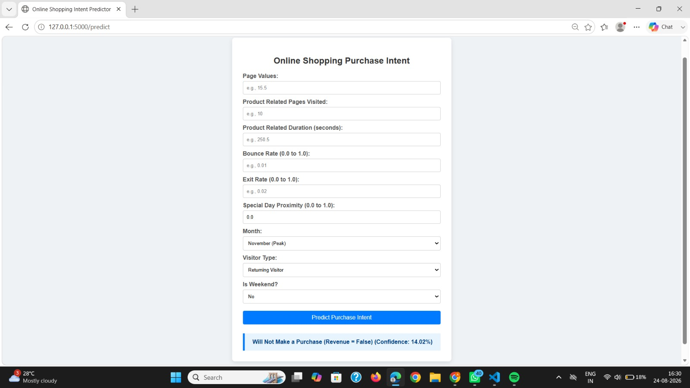

## **🛒 Online Shopping Intention Analysis

An end-to-end machine learning web application designed to evaluate customer purchasing intent in real-time, providing instant predictions alongside transparent confidence scoring using a trained Logistic Regression model and Flask.

## 🚀 Project Overview / Description

* **What the project does:** The Online Shopping Intent Predictor is an end-to-end web application built with Flask[cite: 2] that evaluates online shopping behavior and purchase intent in real time. It takes customer session features—such as page values, product-related duration, bounce rates, visit month, and visitor type[cite: 7]—processes them through a trained classification model and scaler[cite: 2], and instantly outputs a purchase prediction accompanied by confidence scoring[cite: 2].
* **The problem it solves:** E-commerce platforms often struggle to identify high-conversion user sessions dynamically before visitors leave the site. This project addresses this challenge by automating the user intent risk and conversion assessment pipeline using predictive analytics. It replaces guesswork with data-driven consistency while delivering instant feedback via a clean web interface[cite: 7].
* **Primary use case:** Designed for e-commerce platforms, marketing optimization teams, or educational environments, the primary use case is to serve as a real-time decision-support tool or portal widget that provides instant pre-qualification insights on active shopper session behavior.

## ✨ Key Features

* **Interactive Web Interface:** A clean, responsive form built with HTML/CSS integrated into Flask[cite: 2, 7] that allows users to easily input session metrics, month selections, and visitor characteristics[cite: 7].
* **Real-Time Predictive Analytics:** Instant purchase intention classification powered by a trained Scikit-Learn Logistic Regression model (`logistic_regression_model.pkl`)[cite: 2].
* **Feature Normalization & Alignment:** Dynamic scaling utilizing a pre-trained `scaler.pkl` pipeline combined with automated one-hot encoded feature mapping (`model_columns.pkl`) to guarantee precise inference alignment[cite: 2, 4, 6].
* **Confidence Scoring Feedback:** Dynamic result blocks that display exact probability confidence metrics alongside purchase intent decisions[cite: 2, 7].

## 📸 Application Preview

Here is a look at the interactive web form and instant prediction result display:



*(Note: Ensure your screenshot image file is placed inside an `assets/` folder in your project directory, or update the path above to match where your image is saved).*

## 🛠 Tech Stack & Dependencies

* **Programming Language:** Python[cite: 2]
* **Web Framework:** Flask (for serving web routes and handling POST requests)[cite: 2]
* **Machine Learning Model:** Scikit-Learn (Logistic Regression classifier and StandardScaler)[cite: 3, 6]
* **Model Persistence & Handling:** Joblib, Pandas, and NumPy[cite: 2]
* **Frontend Template:** HTML5 & CSS3 with Jinja2 templating[cite: 2, 7]

## 📂 Project Structure

```text
├── assets/
│   └── screenshot_form.png        # Application output screenshot
├── app.py                         # Main Flask web application backend script[cite: 2]
├── logistic_regression_model.pkl  # Pre-trained Logistic Regression machine learning model[cite: 2, 3]
├── scaler.pkl                     # Pre-trained StandardScaler object for normalization[cite: 2, 6]
├── model_columns.pkl              # Saved list of trained feature columns for alignment[cite: 2, 4]
├── requirements.txt               # List of required Python packages and dependencies[cite: 5]
├── templates/
│   └── index.html                 # HTML frontend web interface form[cite: 2, 7]
└── README.md                      # Comprehensive project documentation

```

## 📥 Installation & Setup Guide

**Step 1: Clone the repository**
Clone the project repository to your local machine using your terminal:

```bash
git clone <your-repository-url>
cd online-shopping-intent-predictor

```

**Step 2: Set up a virtual environment**
Create and activate a Python virtual environment to manage dependencies locally:

* **On macOS and Linux:**

```bash
python3 -m venv venv
source venv/bin/activate

```

* **On Windows:**

```bash
python -m venv venv
venv\Scripts\activate

```

**Step 3: Install dependencies**
Install required packages using pip:

```bash
pip install -r requirements.txt

```

## ▶️ How to Run / Usage

Follow these steps to launch and test the application locally in your browser:

* **Step 1: Navigate to the project directory**
Ensure you are inside the main folder containing `app.py` and the model artifacts.


* **Step 2: Launch the Flask application**
Run the following command in your terminal:

```bash
python app.py

```

* **Step 3: Access the application in your browser**
Flask will launch a local server (typically at `http://127.0.0.1:5000/`). Open this link in your web browser.


* **Step 4: Test the application**
Fill in session details (such as page values, product-related page duration, bounce/exit rates, month, visitor type, and weekend status) into the web form and click **"Predict Purchase Intent"** to view the real-time prediction result and confidence percentage.


## 📊 Model & Data Details

* **Dataset Overview:** The underlying model is trained on session-based e-commerce shopper data to classify whether a user will generate revenue (`Revenue = True` or `False`).
* **Features Collected & Used:** The application handles numerical metrics and categorical one-hot encoded variables for inference:
* `PageValues`: The average value of the web pages a user visited before completing an e-commerce transaction.
* `ProductRelated` & `ProductRelated_Duration`: Metrics tracking user engagement with product-related pages.


* `BounceRates` & `ExitRates`: Analytics tracking visitor departure behavior.


* `SpecialDay`: Proximity of the visit to a specific special day.


* `Month` & `VisitorType`: Categorical attributes dynamically mapped via one-hot encoded columns matching `model_columns.pkl`.


* `Weekend`: Binary indicator for weekend sessions.


* **Machine Learning & Prediction Logic:**
* The backend uses a Logistic Regression classifier (`logistic_regression_model.pkl`) combined with a `StandardScaler` (`scaler.pkl`).


* User inputs are mapped against the complete set of trained column headers (`model_columns.pkl`), scaled, and passed to the model to compute the binary outcome and probability score (`predict_proba`).


## ⚖️ License

This project is developed for educational and professional portfolio purposes.

## 👤 Author / Acknowledgments

Made with ❤️ as part of Machine Learning Application Development.

```

```
